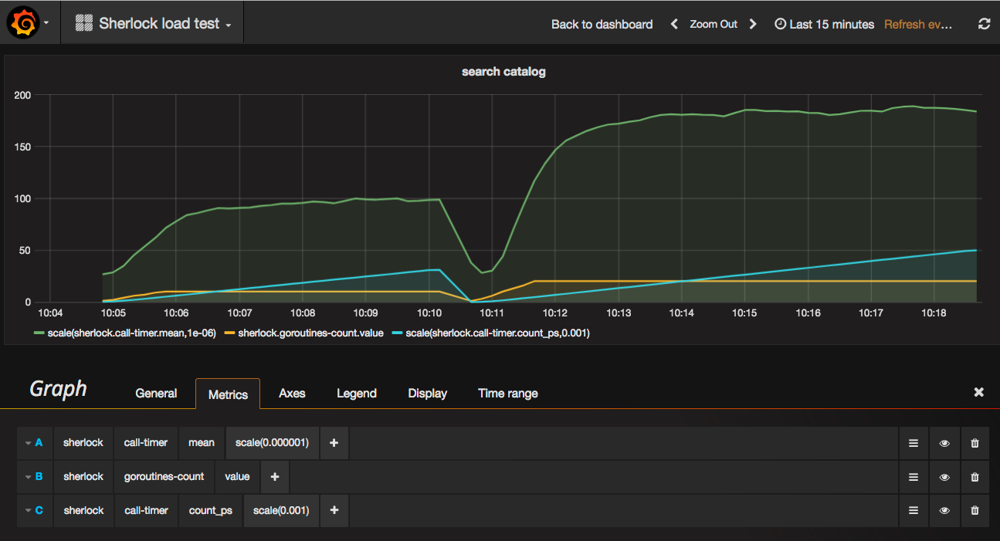

# hazana-grafana-monitoring

# install

    go get github.com/emicklei/hazana-grafana-monitoring

# example

    package main

    import (
        "github.com/emicklei/hazana"
        monitoring "github.com/emicklei/hazana-grafana-monitoring"
    )

    func main() {
        attack := NewZombieAttack("zombies.com:50051")
        hazana.Run(monitoring.WithMonitor(attack), hazana.ConfigFromFlags())
    }

# grafana local

    docker run -d -p 8181:80 -p 8125:8125/udp -p 8126:8126 --publish=2003:2003 --name kamon-grafana-dashboard kamon/grafana_graphite

- Login http://localhost:8181 with admin:admin
- Add new Datasource type Graphite, leave URL empty!
- Add new Dashboard, call it Hazana
- Add Graph Panel, select datasource 

# run load test

- Pass the -m flag to enable sending of metrics to Graphite (default is false).

- Using the -g flag to specifcy the host:port of Graphite (default is :2003).

- Using the -p flag to add a prefix to the metrics sent to Graphite (default is hazana).